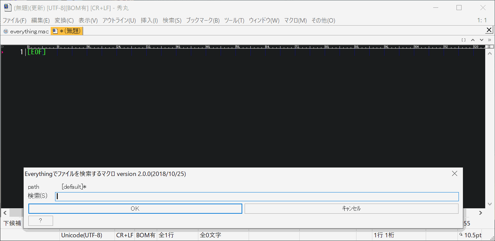

秀丸エディタからEverythingを使用する秀丸マクロ
========

# はじめに
秀丸エディタでファイル検索を高速に行う目的で、ファイル検索ソフトの[Everything](http://www.voidtools.com/)を利用するマクロを書きました。 
秀丸エディタから一瞬たりとも抜けたくない方向けのマクロです。

### そもそもEverythingとは何？
[窓の杜の記事](https://forest.watch.impress.co.jp/docs/serial/winbasic2018/1125142.html)を参照して下さい。

## 動作イメージ

# Everythingの導入方法
## Everythingのインストール
### （ステップ1）
まずは、[Everything本体](http://www.voidtools.com/)を公式サイトからダウンロードしてインストールして下さい。 
インストール中のオプションは既定値で構いません。（後で設定することが出来ます）

### （ステップ2）
`es.exe`のインストール方法 
次に、[Everything](http://www.voidtools.com/)から`ES-バージョン番号.zip`をダウンロードします。 
zipファイル中の`es.exe`をEverythingをインストールしたフォルダへコピーして下さい。 

	 (例)
	 C:\Program Files\Everything\es.exe

[最新版への直リン（2018年10月25日　現在）](https://www.voidtools.com/ES-1.1.0.10.zip)

# 秀丸マクロの導入
### （ステップ1）

全ファイルを秀丸エディタのマクロファイル用のフォルダにコピーしてください。 
`everything.mac`マクロにキーを割り当ててご使用下さい。 

## コピー後のフォルダ構成
	└─hidemaru-macro-folder
	    ├─everything.mac
	    ├─everything.mac.config.ini
	    └─everything_internal
	        ├─search_project_folder.mac
	        └─search_project_folder.mac.config.ini

### （ステップ2）
[でんがくDLL](http://www.ceres.dti.ne.jp/~sugiura/)を秀丸エディタにインストールして下さい。 
ダイアログを表示するために必要なDLLです。

# 操作方法
|ショートカットキー|機能|
|:---|:---|
|F1|ヘルプ表示|
|Ctrl-r|「通常の検索モード、正規表現」の切り替え|
|Ctrl-f,Ctrl-b|検索パス（通常、プロジェクトディレクトリ、カレントディレクトリ）の切り替え|
|Ctrl-d|フルパス、ファイル名検索の切り替え|
|Ctrl-n,Ctrl-p|検索履歴を進める/戻す|
|Ctrl-c,esc|キャンセルして終了|
|enter|確定して終了|

操作方法はVIMの[ctrlp.vim](https://github.com/ctrlpvim/ctrlp.vim)と概ね同じです。

# カスタマイズ
## everything.mac.config.ini
マクロ本体のカスタマイズを行うことが出来ます。

es.exeへのパスは必要に応じて書き換えてください。
> command=C:\Program Files\Everything\es.exe

マッチしたファイルの表示数を調整するには 100 の数値を書き換えてください。
> argument_default=-s -n 100 %s 	 
> argument_regex=-s -n 100 -r %s

## everything_internal\search_project_folder.mac.config.ini
プロジェクトディレクトリをカスタマイズできます。

> [project_folder]	 
> _0=.git	 
> _1=.hg	 
> _2=.svn	 
> _3=.bzr	 
> _4=_darcs	 

# 注意事項
本マクロが意図したとおりに動かないときはまず、Everythingが意図したとおりに動くかどうかを確認し原因の切り分けを行って下さい。

# 更新履歴
### 2018/10/25 ver 2.0.1
説明文を修正。
### 2018/10/08	v2.0.0 
ファイルを高速に見付けるために全て作り直しました。
- リアルタイムで絞り込み検索が出来るようにしました。
- その他機能は操作方法を参照して下さい。

### 2014/09/15	v1.0.1
コメントの編集
### 2014/05/10	v1.0.0 
公開

# 動作確認を行った環境
- Windows 10 64bit
- 秀丸エディタ ver 8.83 64bit
- でんがくDLL Ver.3.20 64bit
- [Everything ver 1.4.1895(x64)](http://www.voidtools.com/)
- [ES.exe ver 1.1.0.10](http://www.voidtools.com/)

# リンク
[Everything](http://www.voidtools.com/)

# 連絡先
<http://d.hatena.ne.jp/ohtorii/>  
<https://github.com/ohtorii/everything>  
<https://twitter.com/ohtorii>
